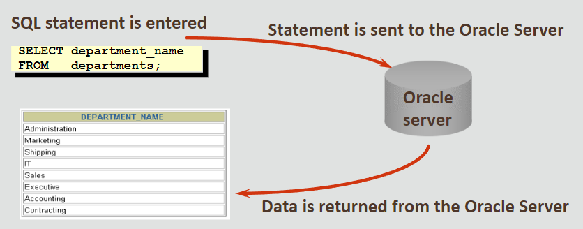
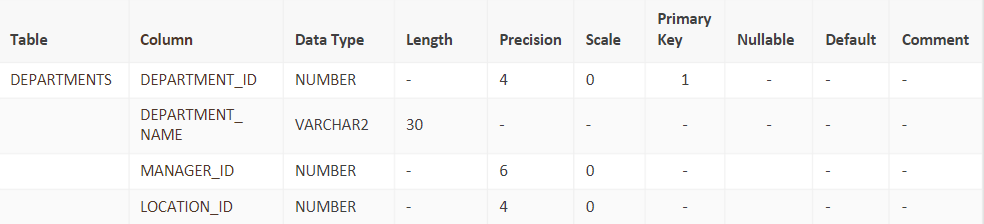

# Oracle

An application is like a car, you just need to know enough to make it work.

 

## Relational Databases

- A relational database allows two or more tables to be related.
- These tables can be considered related when they have a common field

 

### Key Terms to remember
- Table = basic storage structure
- Column = one kind of data in a table
- Row  = data for one table instance
- Field  = the one value found at the intersection of a row and a column
- Primary Key = unique identifier for each row
- Foreign Key = column that refers to a primary key column

 

### Properties of tables
1. Entries in a column are single-valued
2. Entries in a column are of the same kind
3. Each row is unique
4. Sequence of columns is insignificant
5. Sequence of rows is insignificant

 

## Categories of SQL statements

- DML  —  Data Manipulation Language
- DDL  —  Data Definition Language
- TCL  —  Transactional Control Language
- DCL  —  Data Control Language

 

### Data Manipulation

- keywords: `INSERT`, `UPDATE`, `DELETE`, `MERGE`
- used to modify the table data by adding, changing or removing rows

 

### Data Definition

- keywords: `CREATE`, `ALTER`, `DROP`, `RENAME`, `TRUNCATE`
- used to create, change and remove data structures from databases

 

### Transactional Control

- keywords: `COMMIT`, `ROLLBACK`, `SAVEPOINT`
- manage changes made by the DML statements
- can be grouped together into logical transactions

 

### Data Control

- keywords: `GRANT`, `REVOKE`
- give or remove access rights

 

## Describe (DESC)

- display the structure of a table
- `DESC departments;`

 

