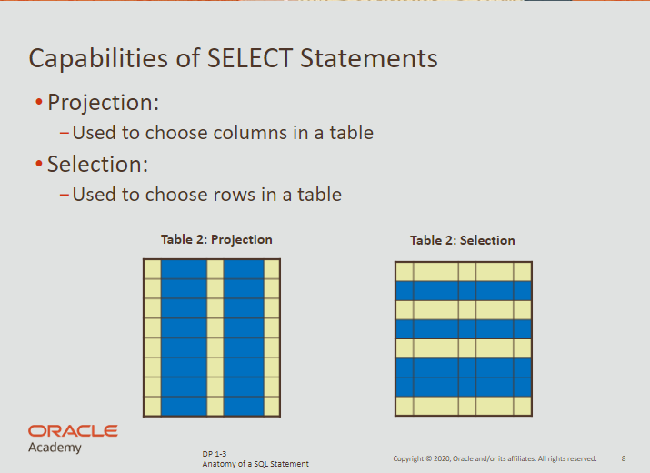
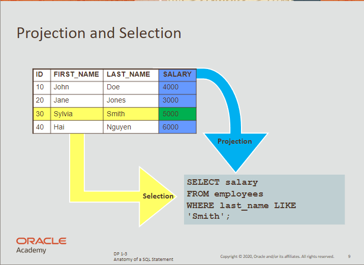
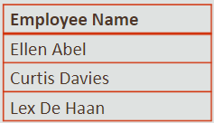

# SELECT

- used for **projection** and for **selection** of data
- used to retrieve information from the database
- has 2 clauses: the `select` and the `from` clause

<br>

## Projection & Selection





<br>

**Returns all the rows in a table (employees)**

```sql
select * 
from employees;
```

<br>

**Return a subset of the data**

```sql
select first_name, last_name, job_id
from employees
where job_id = "SA_REP";
```

```sql
select salary
from employees
where last_name like 'Smith';
```

<br>

**Using arithmetic operators when displaying data**
- doesn’t impact the actual data from the database
- mathematic operator precedence & paranthesis priority applies

```sql
select last_name, salary, 12 * (salary + 100)
from employees;
```

<br>

## NULL

- `NULL` is a value that is unavailable, unassigned, unknown or inapplicable.
- `NULL` is a placeholder used to represent unknown values in a database
- `NULL` is different from the character space or the number zero.

<br>

## Aliases

- A way of renaming a column heading in the output
- Helps you display a column name easier to understand

<br>

### Column aliases:

- renames a column heading
- makes calculations easier to grasp
- immediately follows column name
- may have the optional keyword `as`
- requires double quotation marks `“ ”` :
    - if it contains spaces,
    - if it has special characters
    - if the alias is case-sensitive.
    
<br>

**Example 1**

```sql
select last_name as name, commision_pct as commision
from employees;
```

<br>

**Example 2**

```sql
select last_name "Name", salary*12 "Annual Salary"
from employees;
```

<br>

### Concatenation

- values on the sides of `||` are combined to make a single output column
- links: columns, arithmetic expressions or constant value to create a character expression

<br>

```sql
select first_name || ' ' || last_name as "Employee Name"
from employees;
```



<br>

**Using concatenation to create literal values**

```sql
select last_name || " has a " || 1 || "year salary of " || salary*12 || " dollars " as pay
from employees;
```

<br>

## Distinct

- this removes all the duplicate values
- you must use `distinct` right after `select`

```sql
select **distinct** department_id 
from employees;
```