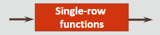
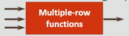

# Functions

- are small programs that perform an action on a value or column
- are used to transform input in one form to output in another form
- functions can be of two types:
  - Single-Row
  - Multiple-Row (Group functions)
 
<br>

## Single-Row Functions

- Manipulate data items
- Return one result per row
- Act on each row returned
- Can modify the data type
- Can be nested

<br>



<br>

**Types of Single-Row Functions**

- General
- Conversion
- Character
- Number
- Date

<br>

## Multiple-Row Functions

- also called *group functions*
- take many rows as input and return a single value output
- input may be the whole table or the table split into smaller groups

<br>



<br>

**Examples of group functions**

- `MAX`  —  find the highest value in a group of rows
- `MIN`  —  find the lowest value in a group of rows
- `AVG`  —  find the average in a group of rows

<br>

## Dual Table

- has one row called “X” and one column called “DUMMY”
- used to create `SELECT` statements and execute functions
- queries using the **DUAL** table return one row as a result

```sql
select (319/29) + 12
from dual;
```