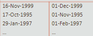
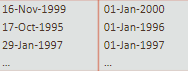
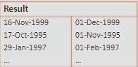
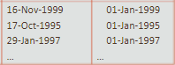
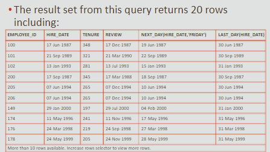

# Date

## Displaying Dates

- Default display and input format is `DD-Mon-YYYY` (02-Dec-2014)
- Valid Oracle dates are between `January 1, 4712 B.C. —  December 31, 9999`

<br>

## SYSDATE

- returns the current database server date and time

```sql
select SYSDATE
from DUAL;
```

<br>

## Operations

**Adds 60 days to hire_date:**

```sql
select last_name, hire_date + 60
from employees;
```

<br>

**Displays number of weeks since hired:**

```sql
select last_name, (SYSDATE - hire_date) / 7
from employees;
```

<br>

**Number of days employee held a job (display as years)**

```sql
select employee_id, (end_date - start_date) / 365 as "Tenure in last job"
from job_history;
```

<br>

## Functions

### MONTHS_BETWEEN

- returns number of calendar months between two dates
- if `first_date` < `second_date`, returns a negative value

```sql
select last_name, hire_date
from employees
where MONTHS_BETWEEN ( SYSDATE, hire_date) > 240
```

<br>

### ADD_MONTHS

- arguments: `date`, `months_number`
- `months_number` can also be negative

```sql
select ADD_MONTHS(SYSDATE,12) as "Next Year"
from dual;
```

<br>

### NEXT_DAY

- arguments: `date`, `weekday`
- returns date of next weekday

```sql
select NEXT_DAY(SYSDATE, 'Saturday') as "Next Saturday"
from DUAL;
```

<br>

### LAST_DAY

- arguments: `date`
- returns date of last day of month

```sql
select LAST_DAY(SYSDATE) as "End of Month"
from DUAL;
```

<br>

### ROUND

- arguments: `date`, `unit`
- returns a date rounded to the unit specified

```sql
SELECT hire_date, ROUND(hire_date, 'Month')
FROM employees
WHERE department_id = 50;
```



<br>

```sql
SELECT hire_date, ROUND(hire_date, 'Year')
FROM employees
WHERE department_id = 50;
```



<br>

### TRUNC

- arguments: `date`, `unit`
- returns a date rounded to the unit specified

```sql
SELECT hire_date, TRUNC(hire_date, 'Month')
FROM employees
WHERE department_id = 50;
```



<br>

```sql
SELECT hire_date, TRUNC(hire_date, 'Year')
FROM employees
WHERE department_id = 50;
```



<br>

*Bonus Example*


    
        
```sql
SELECT employee_id, hire_date,
ROUND (MONTHS BETWEEN (SYSDATE, hire_date)) AS TENURE,
ADD_MONTHS (hire_date, 6) AS REVIEW,
NEXT_DAY (hire_date, 'FRIDAY'), LAST_DAY (hire_date)
FROM employees
WHERE MONTHS BETWEEN (SYSDATE, hire_date) > 36;
```