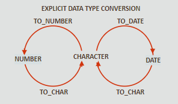

# Conversion

## Implicit and Explicit Conversion

**First, remember this difference:**

- `CHAR`  —  character data of fixed length
- `VARCHAR2`  —  character data of variable length

<br>

**Implicit data conversions**

- `VARCHAR2` / `CHAR`  →  `NUMBER`
- `VARCHAR2` / `CHAR`  →  `DATE`
- `NUMBER`  →  `VARCHAR2`
- `DATE`  →  `VARCHAR2`

<br>

**Explicit data conversions**



<br>

### TO_CHAR (date)

- arguments: `date`, `“format_model”`

<br>

**Useful formatting tips**

- `sp` - spell out a number
- `th` - make number appear as ordinal
- `fm` - remove padded blanks, lead zeroes

| YYYY           | Full year in numbers                             |
| -------------- | ------------------------------------------------ |
| YEAR           | Year spelled out                                 |
| MM             | Two-digi value for month                         |
| MONTH          | Full name of the month                           |
| MON            | Three-letter abbreviation of the month           |
| DY             | Three-letter abbreviation of the day of the week |
| DAY            | Full name of the day of the week                 |
| DD             | Numeric day of the month                         |
| DDspth         | FOURTEENTH                                       |
| Ddspth         | Fourteenth                                       |
| ddspth         | fourteenth                                       |
| DDD or DD or D | Day of the year, month or week                   |
| HH24:MI:SS:AM  | 15:45:32 PM                                      |
| DD “of month”  | 12 of October                                    |

```sql
TO_CHAR(hire_date, 'month dd, YYYY')  ->  June 07, 1994

TO_CHAR(hire_date, 'fmMonth dd, YYYY')  ->  June 7, 1994

TO_CHAR(hire_date, 'fmMonth ddth, YYYY')  ->  June 7th, 1994

TO_CHAR(hire_date, 'fmDay ddth Mon, YYYY')  ->  Tuesday 7th Jun, 1994

TO_CHAR(hire_date, 'fmDay ddthsp Mon, YYYY')  ->  Tuesday, seventh, Jun, 1994

TO_CHAR(hire_date, 'fmDay, ddthsp "of" Month, Year')  
->  Tuesday, seventh of June, Nineteen Ninety-Four

TO_CHAR(SYSDATE, 'hh:mm')  ->  02:07

TO_CHAR(SYSDATE, 'hh:mm pm')  ->  02:07 am

TO_CHAR(SYSDATE, 'hh:mm:ss pm')  ->  02:07:23 am
```

<br>

### TO_CHAR (number)

- arguments: `number`, `“format_model”`

```sql
TO_CHAR(24000, '$99,999')  ->  $24,000  

TO_CHAR(3000, '$99999.99')  ->  $3000.00   

TO_CHAR(4500, '$99,999')  ->  4,500  

TO_CHAR(9000, '$99,999.99')  ->  9,000.00

TO_CHAR(4422, '0009999')  ->  0004422
```

| Element | Description                                        | Example    | Result   |
| ------- | -------------------------------------------------- | ---------- | -------- |
| 9       | Numeric position (# of 9’s determine width)        | 999999     | 1234     |
| 0       | Display leading zeros                              | 099999     | 01234    |
| $       | Floating dollar sign                               | $999999    | $1234    |
| L       | Floating local currency symbol                     | L999999    | FF1234   |
| .       | Decimal point in position specified                | 999999.99  | 1234.00  |
| ,       | Comma in position specified                        | 999,999    | 1,234    |
| MI      | Minus signs to right (negative values)             | 999999MI   | 1234-    |
| PR      | Parenthesize negative numbers                      | 999999PR   | <1234>   |
| EEEE    | Scientific notation (must have four EEEE)          | 99.999EEEE | 1,23E+03 |
| V       | Multiply by 10 n times (n = number of 9’s after V) | 9999V99    | 9999V99  |
| B       | Display zero values as blank, not 0                | B9999.99   | 1234.00  |

<br>

### TO_NUMBER (string)

- arguments: `string`, `“format_model”`

> Format model is optional, but should be included if the character string being converted contains any character other than numbers. <br>
> Always make sure you correctly type in the “format_model”, even the number of characters counts.

**A valid example is:**

```sql
select TO_NUMBER ('5,320', '9,999')  ->  5320
from DUAL;
```

<br>

**A bad example is:**

```sql
select last_name, TO_NUMBER(bonus, '999')
from employees
where department_id = 80;
```

<br>

### TO_DATE (string)

- arguments: `string`, `“format_model”`
- `format_model` tells the server what the character string looks like

```sql
TO_DATE('November 3, 2001', 'Month dd, yyyy')  ->  03-Nov-2021
```

<br>

### FX Modifier

The `fx` modifier specifies exact matching between character arguement & date format.

```sql
TO_DATE ('May10,1989', 'fxMonDD, YYYY')  ->  10-May-1989
```

<br>

**FX Modifier Rules**

- `string` and `format_model` are not case-sensitive. 😎
- `string` cannot have extra blanks (without `fx`, server ignores them)
- Punctuation and quoted text in `string` must match exactly the `format_model`
- Numeric data in `string` must have same number of digits as in the `format_model`
- Without `fx`, numbers in the `string` argument can omit leading zeros

```sql
TO_DATE('Sep 07, 1965', 'fxMon dd, YYYY')  ->  07-Sep-1965

TO_DATE('July312004, 1965', 'fxMonthDDYYYY')  ->  31-Jul-1965

TO_DATE('June 19, 1990', 'fxMonth dd, YYYY')  ->  19-Jun-1965
```

<br>

### Legacy Warning - RR & YY

> All date data should now be stored using four-digit years (YYYY). <br>
> However, some legacy databases may still use the two-digit format (YY). 
> Oracle has a way of interpreting these dates in the correct century.

<br>

**How to deal with the legacy century problem?**

- `YY`  —  assumes `format_model` is in the current century
- `RR`  —  used when two-digit year is not in the current century

```sql
TO_DATE('27-Oct-95'), 'DD-Mon-YY')  ->  27-Oct-2095 

TO_DATE('27-Oct-95'), 'DD-Mon-RR')  ->  27-Oct-1995 
```

| Current Year | Specified Date | RR Format | YY Format |
| ------------ | -------------- | --------- | --------- |
| 1995         | 27-Oct-95      | 1995      | 1995      |
| 1995         | 27-Oct-17      | 2017      | 1917      |
| 2017         | 27-Oct-17      | 2017      | 2017      |
| 2017         | 27-Oct-95      | 1995      | 2095      |

<br>

**Bad exemple:**

```sql
select last_name, TO_CHAR(hire_date, 'DD-Mon-YY')
from employees
where hire_date < TO_DATE('01-Jan-90', 'DD-Mon-YY')
```

> When I query my employee database using the previous statement , it return every row in the table. <br>
> However, I know there are only a few employees who were hired before 1990. <br>
> The format model in the `WHERE` clause uses `YY` and the current year is 2017. <br>
> Therefore, query returns rows with hire_date less than 2090. This is why I should’ve used `RR`.