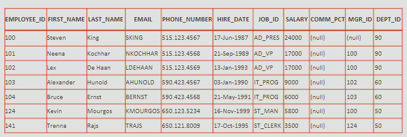
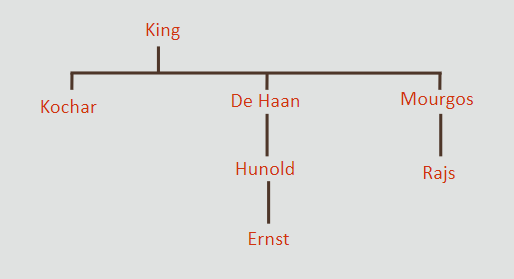
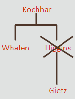
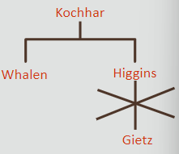

# Self-joins & Hierarchy

## Self-Joins

> Used to join a table to itself as if it was two tables.

```sql
select worker.last_name || ' works for ' || manager.last_name 
as "Works for"
from employees worker JOIN employees manager
on (worker.manager_id = manager.employee_id);
```

| employee_id | last_name | manager_id |
| ----------- | --------- | ---------- |
| 100         | King      |            |
| 101         | Kochar    | 100        |
| 102         | De Haan   | 100        |
| 103         | Hunold    | 102        |
| 104         | Ernst     | 103        |
| 107         | Lorentz   | 103        |
| 124         | Mourgos   | 100        |

<br>

```sql
select wrkr.last_name, wrkr.manager_id, mngr.last_name as "Manager"
from employees wrkr JOIN employees mngr
on (wrkr.manager_id = mngr.employee_id);
```

| Last_NAME | MANAGER_ID | MANAGER |
| --------- | ---------- | ------- |
| Kochhar   | 100        | King    |
| De Haan   | 100        | King    |
| Hunold    | 102        | De Haan |
| Ernst     | 103        | Hunold  |
| Lorentz   | 103        | Hunold  |
| Mourgos   | 100        | King    |

<br>

### Hierarchical Queries

- Closely related to self-joins 
- Help you see who the manager works for 
- Usecase example: building an Organization Chart.

<br>

***Example of hierarchy***
    

    

    
<br>

**Keywords for hierarchical queries**

- `START WITH`  —  identify row to use as root
- `CONNECT BY PRIOR`  —  explains how to do inter-row joins
- `LEVEL`  —  specifies how many branches deep the tree wil traverse

```sql
select employee_id, last_name, job_id, manager_id 
from employees
START WITH employee_id = 100
CONNECT BY PRIOR employee_id = manager_id;
```

| EMPLOYEE_ID | LAST_NAME | JOB_ID     | MANAGER_ID |
| ----------- | --------- | ---------- | ---------- |
| 100         | King      | AD_PRES    | -          |
| 101         | Kocchar   | AD_VP      | 100        |
| 200         | Whalen    | AD_ASST    | 101        |
| 205         | Higgins   | AC_MGR     | 101        |
| 206         | Gietz     | AC_ACCOUNT | 205        |
| 102         | De Haan   | AD_VP      | 100        |
| 103         | Hunold    | IT_PROG    | 102        |
| 104         | Ernst     | IT_PROG    | 103        |

<br>

```sql
select last_name || ' reports to ' || PRIOR last_name as "Reports"
from employes
start with last_name = 'King'
connect by prio employee_id = manager_id;
```

| Reports                    |
| -------------------------- |
| King reports to            |
| Kocchar reports to King    |
| Whalen reports to Kochhar  |
| Higgins reports to Kochhar |
| De Haan reports to King    |
| Hunold reports to De Haan  |
| Ernst reports to Hunold    |

<br>

```sql
select LEVEL, last_name || ' reports to ' || PRIOR last_name as "Txt"
from employees
start with last_name = 'King'
connect by prior employee_id = manager_id;
```

| LEVEL | Txt                        |
| ----- | -------------------------- |
| 1     | King reports to            |
| 2     | Kocchar reports to King    |
| 3     | Whalen reports to Kochhar  |
| 3     | Higgins reports to Kochhar |
| 4     | Gietz reports to Higgins   |
| 2     | De Haan reports to King    |
| 3     | Hunold reports to De Haan  |
| 4     | Ernst reports to Hunold    |

<br>

```sql
select LPAD(last_name, LENGTH(last_name) + (LEVEL*2)-2, '_') as "Org"
from employees 
start with last_name = 'King'
connect by prior employee_id = manager_id;
```

| Org           |
| ------------- |
| King          |
| __Kochhar     |
| ____Whalen    |
| ____Higgins   |
| ______Gietz   |
| __De Haan     |
| ____Hunoid    |
| ______Ernst   |
| ______Lorentz |

<br>

```sql
select LPAD(last_name, LENGTH(last_name) + (LEVEL*2)-2, '_') as "Org"
from employees
start with last_name = 'Grant'
connect by employee_id = PRIOR manager_id
```

| Org       |
| --------- |
| Grant     |
| __Zlotkey |
| ____King  |

<br>

### Hierarchical Queries Pruning

Pruning branches can be done with:

- `WHERE`  —  only row named in statement is excluded
- `CONNECT BY PRIOR`  —  the entire branch is excluded

```sql
select last_name
from employees
where last_name != 'Higgins'
START WITH last_name = 'Kochhar'
CONNECT BY PRIOR employee_id = manager_id;
```



<br>

```sql
select last_name
from employees
START WITH last_name = 'Kochhar'
CONNECT BY PRIOR employee_id = manager_id
AND last_name != 'Higgins';
```

