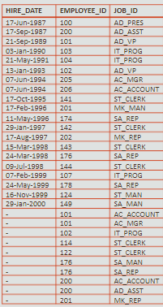

# Set Operators

- used to combine the results from different select statements in one output

<br>

A  =  { 1, 2, 3, 4, 5 } <br>
B  =  { 4, 5, 6, 7, 8 }

<br>

**Table A** 

| 1   |
| --- |
| 2   |
| 3   |
| 4   |
| 5   |

<br>

**Table B**

| 4   |
| --- |
| 5   |
| 6   |
| 7   |
| 8   |

<br>

### Rules to Remeber

- Names of the columns need not to be identical
- Number of columns must be identical in every `select`
- Data types of columns must be identical in every `select`
- Column names in the output are taken from the first `select`

<br>

## UNION

- Returns all rows from both tables after eliminating duplicates

```sql
select a_id
from a 

UNION

select b_id
from b;
```

<br>

### UNION ALL

- Returns all rows from both tables, without eliminating duplicates

```sql
select a_id
from a 

UNION ALL

select b_id
from b;
```

<br>

### INTERSECT

- Returns all rows common to both tables

```sql
select a_id
from a 

INTERSECT

select b_id
from b;
```

<br>

### MINUS

- Returns all rows found in one table but not the other

```sql
select a_id
from a 

MINUS

select b_id
from b;
```

<br>

### When having no common columns...

- You can use null values to create an artificial common column

```sql
select hire_date, employee_id, job_id
from employees

UNION

select TO_DATE(NULL), employee_id, job_id
from job_history;
```

<br>



<br>

## Set Operators & ORDER BY

- if you want to control the order or returned rows use `order by` just once

<br>

```sql
select hire_date, employee_id, job_id
from employees

union 

select TO_DATE(NULL), employee_id, job_id
from job_history;
ORDER BY employee_id
```

<br>

| HIRE_DATE   | EMPLOYEE_ID | JOB_ID     |
| ----------- | ----------- | ---------- |
| 17-Jun-1987 | 100         | AD_PRES    |
| 21-Sep-1989 | 101         | AD_VP      |
| -           | 101         | AC_ACCOUNT |
| -           | 101         | AC_MGR     |
| 13-Jan-1993 | 102         | AD_VP      |
| -           | 102         | IT_PROG    |
| 03-Jan-1990 | 103         | IT_PROG    |
| 21-May-1991 | 104         | IT_PROG    |
| 07-Feb-1999 | 107         | IT_PROG    |
| -           | 114         | ST_CLERK   |