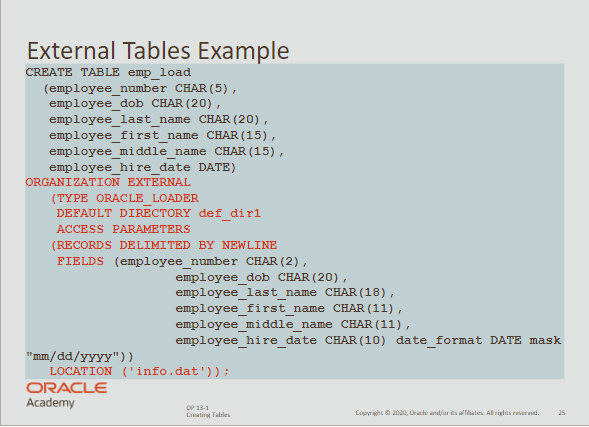

# CREATE

## Database Objects

**The main database object types are:**

- Table
- Index
- Constraint
- View
- Sequence
- Synonym

<br>

**Segments** 

- are database objects taking up significant storage space.
- tables and indexes are known as segments, taking up significant disk space
- views, constraints, sequences and synonyms don’t take up that much space

<br>

## CREATE a table

**When creating a new table name:**

- Must be plural (e.g. STUDENTS)
- Must begin with a letter
- Must be 1 to 30 characters
- Must not duplicate other objects
- Must not be an Oracle reserved word
- Must contain only alphanum, `_` , `$`,  `#`

<br>

**Other DDL statements include:**

- `DROP`
- `ALTER`
- `RENAME`
- `TRUNCATE`

<br>

**Example 1**

```sql
create table my_cd_collection
( cd_number NUMBER(3), 
	title varchar2(20),
	artist varchar2(20),
	purchase_date DATE default SYSDATE
);
```

<br>

**Example 2**

```sql
create table my_friends
( first_name varchar2(20), 
	last_name varchar2(30),
	email varchar2(30),
	phone_num varchar2(12),
	birth_date DATE
);
```

<br>

## External tables

- Oracle also supports another table type: ***External table***
- In this table, data rows are not held inside the database files.
- Instead, data rows are found in a flat file, stored externally to the database.

<br>

**Important** <br>
External tables can be used to store data migrated from older versions.

<br>

**Creating external tables**



<br>

`ORGANIZATION EXTERNAL`  —  creates the external table

`TYPE ORACLE_LOADER`  —  of type Oracle Loader (an Oracle Product)

`DEFAULT DIRECTORY def_dir1`  —  name of the directory for the file

`ACCESS PARAMETERS`  —  how to read the file

`RECORDS DELIMITED BY NEWLINE`  —  how to identify the start of a new row

`FIELD`  —  the field name and the data type specifications

`LOCATION`  —  name of the actual file containing the data

<br>

## Data Dictionary

- All database objects are stored in the *Data Dictionary*
- The dictionary itself can be queried by all database users.
- You can find all the extra options in the ***Object Browser*** interface.

<br>

**Data Dictionary is composed of:**

- User Tables (created by you)
- Data Dictionary Tables (Oracle SYS)

<br>

**To investigate the indexes**

```sql
select *
from user_indexes;
```

<br>

**To investigate the sequences**

```sql
select *
from user_objects
where object_type = 'SEQUENCE';
```