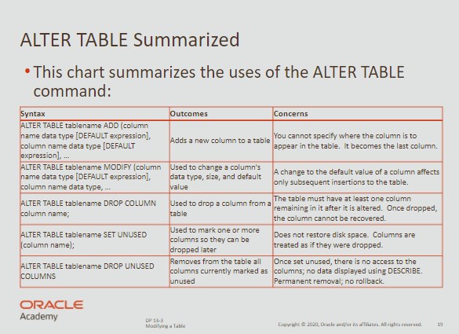
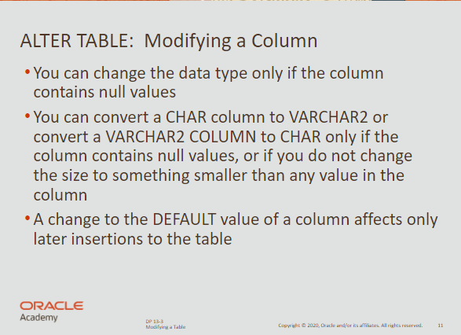
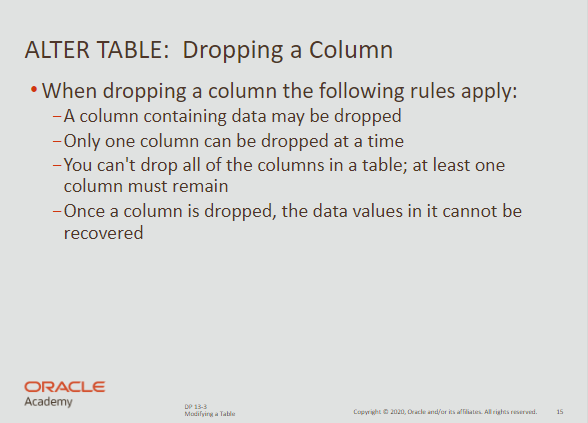

# Table Modifying

## ALTER TABLE

- used to impact the columns within a table



<br>

## ADD

- Used to add a new column to a table

```sql
ALTER TABL my_cd_collection
ADD (release_date DATE DEFAULT SYSDATE);
```

<br>

```sql
ALTER TABLE my_friends
ADD (favorite_game VARCHAR2(30));
```

<br>

### MODIFY



<br>

**Example**

```sql
create table mod_emp
( last_name VARCHAR2(20),
	salary NUMBER(8,2)
);

ALTER TABLE mod_emp
MODIFY (last_name VARCHAR2(30));
```

<br>

## DROP



<br>

**Removes a column**

```sql
ALTER TABLE table_name
DROP COLUMN column_name;
```

<br>

## SET UNUSED

- Dropping a column from a large table can take a long time
- A quicker alternative is to mark the column as unusable

```sql
ALTER TABLE table_name SET UNUSED (column_name);
```

<br>

**You can even drop unused column to free disk space**

```sql
ALTER TABLE table_name
DROP UNUSED COLUMNS;
```

<br>

## DROP TABLE

- removes the definition of an Oracle Table

<br>

```sql
ALTER SESSION SET RECYCLEBIN = ON;
DROP TABLE table_name;
```

<br>

## FLASHBACK TABLE

- used to potentially recover dropped databases
- you can also see recycled objects querying `USER_RECYCLEBIN`

<br>

```sql
FLASHBACK TABLE table_name TO BEFORE DROP;
```

<br>

**You can also bypass the recycle bin**

```sql
drop table table_name PURGE;
```

<br>

## RENAME

- to change the name of a table

```sql
RENAME old_name to new_name;
```

<br>

## TRUNCATE

- removes all rows from a table
- you cannot roll back row removal

```sql
TRUNCATE TABLE table_name;
```

<br>

`TRUNCATE` is faster than `DELETE` because it generates no rollback information.

<br>

## COMMENT ON TABLE

- You can add a comment of up to 2000 characters

```sql
COMMENT ON TABLE table_name | COLUMN table.column
is 'place your comment here';
```

<br>

## FLASHBACK QUERY

- Oracle automatically commits data and has a version history
- The copies are held in a special place called ***UNDO tablespace***

<br>

**Syntax**

```sql
select employee_id, first_name || ' ' || last_name as "NAME",
versions_operation as "Operation",
versions_starttime as "Start_date",
versions_endtime as "END_DATE", salary

from employees
versions between SCN MINVALUE AND MAXVALUE

where employee_id = 1;
```

<br>

**Example**

```sql
insert into copy_employees values 
( 1, 'Natasha', 'Hansen', 'NHANSEN', '4412312341234',
	'07-sep-1998', 'AD_VP', 12000, null, 100, 90, NULL
);

update copy_employees
set salary = 1
where employee_id = 1;

select employee_id, first_name || ' ' || last_name as "NAME",
	versions_operation as "Operation",
	versions_starttime as "Start_date",
	versions_endtime as "END_DATE", salary
from employees
	versions between SCN MINVALUE AND MAXVALUE
where employee_id = 1;
```

<br>

| EMPLOYEE_ID | NAME           | OPERATION | START_DATE              | END_DATE                | SALARY |
| ----------- | -------------- | --------- | ----------------------- | ----------------------- | ------ |
| 1           | Natasha Hansen | D         | 07-SEP-1998 07.00.10 AM | -                       | 1      |
| 1           | Natasha Hansen | U         | 07-SEP-1998 06.57.01 AM | -                       | 1      |
| 1           | Natacha Hansen | I         | 07-SEP-1998 06.51.58 AM | 07-SEP-1998 06.57.01 AM | 12000  |