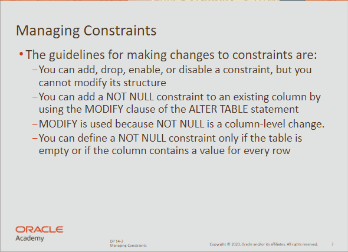

# Constraints

## Integrity Constraint Errors

- created to ensure that the data conforms to a needed set of rules
- if any rule would be brken by a DML statement, an error is returned

<br>

## Fundamentals

- Constraints can be viewed as database rules.
- All constraints are stored in the data dictionary
- Constraints must be given a name (max. 30 char).
- Enforce rules on the data whenever a row is:
    - inserted
    - updated
    - deleted

<br>

**You can enforce constraints at the:**

- column level  —  next to name and data type
- table level  —  after all the column names are listed

<br>

**There are five types of constraints**

- `NOT NULL`
- `UNIQUE`
- `PRIMARY KEY`
- `FOREIGN KEY`
- `CHECK`

<br>

## Column-Level Constraint

```sql
create table clients
(
	client_num NUMBER(4) 
	***CONSTRAINT clients_client_num_pk PRIMARY KEY,***

	first_name VARCHAR2(14)
	***CONSTRAINT clients_last_name_nn NOT NULL,***

	last_name VARCHAR2(13)
	***CONSTRAINT clients_email_uk UNIQUE,***
);
```

<br>

## Table-Level Constraint


```sql
CREATE TABEL clients
(
	client_number NUMBER(6) NOT NULL,
	first_name varchar2(20), 
	last_name varchar2(20),
	phone varchar2(20),
	email varchar2(10) NOT NULL,
***CONSTRAINT clients_phone_email_uk UNIQUE (email, phone)
);***
```

<br>

## Basic Rules for Constraints


- Constraints that refer to more than one column must be table-level.
- The `NOT NULL` constraint can be specified only at the column level.
- `UNIQUE`, `PRIMARY KEY`, `FOREIGN KEY`, `CHECK` can be defined at either.

<br>

## NOT NULL


- requires that for every row entered, a value must exist for this column
- usually `NOT NULL` constraints used the name suffix `_nn`

<br>

## UNIQUE


- can be applied to either a column or a set of column
- requires that every row entered must be unique at that column / set
- usually `UNIQUE` constraints used the name suffix `_uk`
- ***e.g.*** unique email adress for each employee

<br>

## PRIMARY KEY


- a table can have only one primary key
- can be applied to either a column or a set of column
- values are used to uniquely identify each row in a table
- no column part of the PRIMARY KEY can contain a null
- usually `PRIMARY KEY` constraints used the name suffix `_pk`

<br>

## FOREIGN KEY

- also called *referential integrity* constraint
- can be applied to either a column or a set of column
- foreign keys link back to `PRIMARY KEY` of another table
- usually `FOREIGN KEY` constraints used the name suffix `_fk`
- relationships between tables are based on the link between `_pk` and `_fk`

<br>

**Importanat** <br>
A foreign key can only be defined if the primary key already exists!

<br>

```sql
create table clients
(
	client_num NUMBER(4) 
	CONSTRAINT clients_client_num_pk PRIMARY KEY,
******
	department_id NUMBER(4)
	***CONSTRAINT clients_dept_id_fk REFERENCES departments(department_id)***
);
```

<br>

## ON DELETE CASCADE

- when a row in the parent table is deleted, child row dependent are deleted
- no `ON DELETE CASCADE` results in an error when deleting parent rows

<br>

```sql
create table clients
(
	client_num NUMBER(4) 
	CONSTRAINT clients_client_num_pk PRIMARY KEY,

	department_id NUMBER(4)
	CONSTRAINT clients_dept_id_fk 
	FOREIGN KEY departments(department_id) ***ON DELETE CASCADE*** 
);
```
*Now, deleting parent rows will also delete dependent child rows*

<br>

## ON DELETE SET NULL

- same as `ON DELETE CASCADE`, but sets remaining child rows to `NULL`

<br>

```sql
create table clients
(
	client_num NUMBER(4) 
	CONSTRAINT clients_client_num_pk PRIMARY KEY,

	department_id NUMBER(4)
	CONSTRAINT clients_dept_id_fk 
	FOREIGN KEY departments(department_id) ***ON DELETE SET NULL***
);
```

<br>

## CHECK

- explicitly defines a condition that must be met
- to satisfy the constraint each row must meet the condition
- meeting a condition can be done through `True` or `unknown`
- can only refer to columns in specified table, not from other tables

<br>

```sql
create table job_history
(
	employee_id NUMBER(6,0),
	start_date DATE, 
	end_date DATE,
	job_id VARCHAR2(10),
	department_id NUMBER(4,0),
	CONSTRAINT his_id_st_date_pk PRIMARY KEY (employee_id, start_date),
	***CONSTRAINT his_end_ck CHECK (end_date > start_date)***
);
```
*Checks if end_date is later than the start_date*

<br>

**Important** <br>
You cannot use `SYSDATE` within a `CHECK` constraint !!!***

<br>

## Managing Constraints



<br>

`ALTER TABLE` is used to make changes to constraints in existing tables:

- adding constraints
- dropping constraints
- enabling constraints
- disabling constraints
- adding `NOT NULL`

<br>

**Example for simple constraint**

```sql
ALTER TABLE employees
ADD CONSTRAINT emp_id_pk PRIMARY KEY (employee_id);
```

<br>

**Syntax for adding foreign keys**

```sql
ALTER TABLE table_name
ADD CONSTRAINT constr_name  FOREIGN KEY (column_name)
														REFERENCES table_name2(column_name);
```

<br>

**Adding a not null constraint**

```sql
ALTER TABLE table_name
MODIFY (email CONSTRAINT emp_email_nn NOT NULL);
```
*Can be added only if the table is empty or all rows have values*

<br>

**Dropping constraints**

```sql
ALTER TABLE table_name
DROP CONSTRAINT name CASCADE;
```

<br>

**Disabling constraints**

```sql
ALTER TABLE table_name
DISABLE CONSTRAINT name_fk;
```

<br>

**Cascade Disabling constraints**

```sql
ALTER TABLE table_name
DISABLE CONSTRAINT name_fk CASCADE;
```
*If you enable the main constraint, cascaded ones won’t enable*

<br>

**Enabling Constraints**

```sql
ALTER TABLE table_name
ENABLE CONSTRAINT name;
```

<br>

**Important** <br>
You won’t be able to disable primary keys if foreign rows exist.

<br>

**Viewing all constraints**

```sql
select constraint_name, table_name, constraint_type, status
from USER_CONSTRAINTS
where table_name = 'TABLE_NAME';
```

<br>

**Important** <br>
You can’t drop a column in a table, if it’s referenced in a constraint.