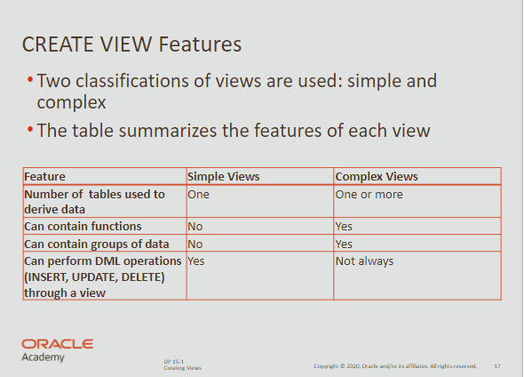
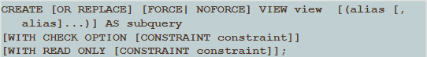
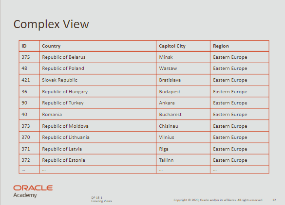

# Views

- A view is a database object and containts no data of their own.
- It’s a logical representation of existing tables or of an another view.

<br>

## Creating Views



<br>

### Simple view

```sql
CREATE VIEW view_employees AS
	select employee_id, first_name, last_name, email
	from emplyoees
	where employee_id BETWEEN 100 and 124;
```

<br>

### Advanced syntax



| OR REPLACE        | re-creates the view if it already exists                    |
| ----------------- | ----------------------------------------------------------- |
| FORCE             | creates the view whether or not the base tables exist       |
| NOFORCE           | creates the view only if the base table exists (default)    |
| view_name         | specifies the name of the view                              |
| alias             | alias name for each expression selected by the view’s query |
| subquery          | complete select statement, can contain aliases for columns  |
| WITH CHECK OPTION | rows remain accessible after input or update operations     |
| CONSTRAINT        | is the name assigned to the CHECK OPTION constraint         |
| WITH READ ONLY    | ensures that no DML operations can be performed on view     |

<br>

### Simple View

**Important** <br>
Do not use an order by clause when defining the view.

<br>

```sql
CREATE OR REPLACE VIEW view_euro_countries AS
	select country_id, region_id, country_nam, capitol
	from wf_countries
	where location LIKE '%Europe';
```

```sql
select * from view_euro_countries
order by country_name
```

<br>

### Complex View



<br>

```sql
CREATE OR REPLACE VIEW view_euro_countries 
	("ID", "Country", "Capitol City", "Region")
AS
	select c.country_id, c.country_nam, c.capitol, r.region_id,
	from wf_countries c JOIN wf_world_regions r
	using (region_id)
	where location LIKE '%Europe';
```

```sql
select *
from view_euro_countries;
```

<br>

**You can also use group functions with complex views**

```sql
CREATE OR REPLACE VIEW view_high_pop
	("Region ID", "Highest population")
AS
	select region_id, MAX(population),
	from wf_countries
	group by region_id
```

```sql
select * from view_high_prop;
```

<br>

## DML Operations

- DB Managers can allows users to change data from the base table.

<br>

**This allows managers of department 50 to see employee information**

```sql
CREATE VIEW view_dept50 AS
	select department_id, employee_id, first_name, last_name, salary
	from copy_employees
	where department_id = 50;
```
*This will allow operations such as INSERT, UPDATE and DELETE*

<br>

```sql
UPDATE view_dept50
set department_id = 90
where department_id = 124; 
```
*Operation succeeds even though this employee is now not part of view.*

<br>

**To control data access, you can use:**

- `WITH CHECK OPTION`
- `WITH READ ONLY`

<br>

## `WITH CHECK OPTION`
- deny access to rows outside of view

<br>

```sql
CREATE VIEW view_dept50 AS
	select department_id, employee_id, first_name, last_name, salary
	from copy_employees
	where department_id = 50;
***WITH CHECK OPTION CONSTRAINT view_dept50_check***
```
*Now you cannot modify a row outside the domain of the view*

<br>

## `WITH READ ONLY`  
- deny access to modify any rows

<br>

```sql
CREATE VIEW view_dept50 AS
	select department_id, employee_id, first_name, last_name, salary
	from copy_employees
	where department_id = 50;
***WITH READ ONLY;***
```
*Any attempt to execute an INSERT, UPDATE or DELETE won’t work*

<br>

### DML Restrictions

**Cannot remove a row from underlying base table if view contains:**

- Group Functions
- Group by clause
- DISTINCT Keyword
- ROWNUM Keyword

<br>

**Cannot modify data if view contains:**

- Group Functions
- Group by clause
- DISTINCT Keyword
- ROWNUM Keyword
- Columns defined by expressions

<br>

**Cannot add data if view contains:**

- Group Functions
- Group by clause
- DISTINCT Keyword
- ROWNUM Keyword
- Columns defined by expressions
- Does not include NOT NULL columns in base tables

<br>

## Managing Views

**Deleting a view** <br> 
`DROP VIEW viewname;`

<br>

## Inline views

```sql
select e.last_name, e.salary, e.department_id, d.maxsal 
from employees e, (
	***select department_id, max(salary) maxsal
	from employees
	group by department_id) d*** 
where e.department_id = d.department_id
and e.salary = d.maxsal;
```

<br>

## TOP-N-ANALYSIS

- SQL operation used to rank results
- useful when you want to retrieve top n records

<br>

```sql
select ROWNUM as "Longest Employed", last_name, hire_date
from employees
where ROWNUM <= 5
order by hire_date;
```
*Will only output the first five rows* 

<br>

**TOP-N-ANALYSIS and INLINE VIEWS**

```sql
select ROWNUM as "Longest Employed", last_name, hire_date
from 
	(
	select last_name, hire_date
	from employees
	order by hire_date
	)
where ROWNUM <= 5
```
*Will only output the first five rows* 