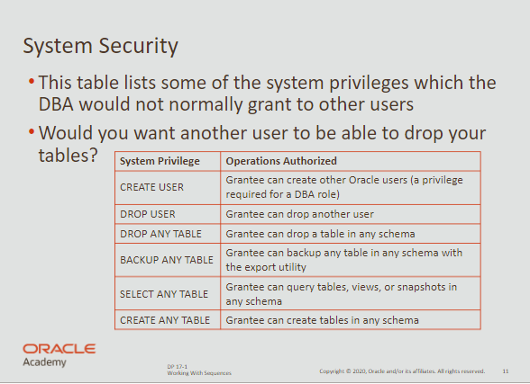
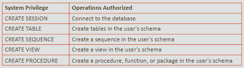
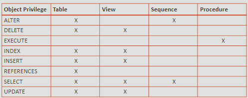

# Controlling User Access

## FOR UPDATE

- locks rows that are soon going to be changed in the database
- the rows are locked by the user who ran the select statement
- to unlock them, the user issues a `COMMIT` or `ROLLBACK`

<br>

```sql
select e.employee_id, e.salary, d.department_name
from employees e JOIN departments d USING department_id
where job_id = 'ST_CLERK' AND location_id = 1500 FOR UPDATE
order by e.employee_id;
```

<br>

## Controlling User Access

> In a multiple-user environment, you want to maintain database security.

<br>

**Database means:**

- Data security
- System security

<br>

## Privileges and Schemas



<br>

> There are more than 100 distinct system privileges.

- **Privilege** is the right to execute particular SQL statements
- **DBA** is a high-level user able to grant the users access
- **Users** require object privileges to manipulaet data.
- **Users** can also be given privilege to grant privileges.

<br>

**How to create an user**

```sql
CREATE USER user_name
IDENTIFIED BY password;
```

<br>

**How to change your password**

```sql
ALTER USER user_name 
IDENTIFIED BY new_password;
```

<br>

**How to grant privileges**

```sql
GRANT create session, create table, create sequence, create view
TO user_name;
```

<br>

**Examples of privileges**



<br>

### Object Privileges

**Each object has a particular set of grantable privileges**



<br>

**Important** <br>
✅ You can grant `UPDATE`, `REFERENCES`, `INSERT` on individual columns. <br>
⛔ You can’t grant `SELECT` on individual columns, but you can use views.

<br>

```sql
GRANT UPDATE (salary)
ON employees TO user_name;
```

<br>

**Granting access to all users**

```sql
GRANT select 
ON alice.departments
TO PUBLIC;
```