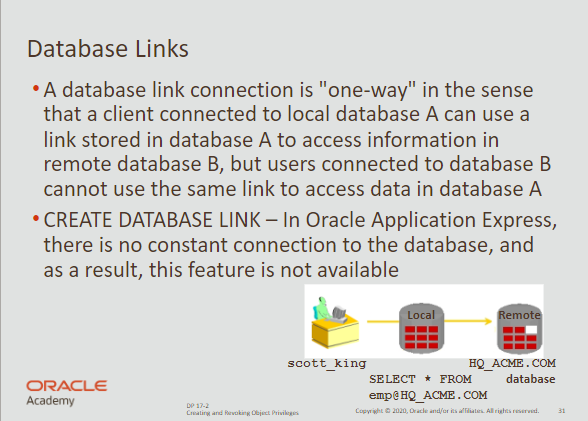

# Create & Revoke Privileges

## Roles

- a named group of related privileges that can be granted to a user
- this method makes it easier to revoke and maintain privileges
- roles are typically created for a database application

<br>

**Create and grant privileges to a role**

```sql
CREATE ROLE manager;

GRANT create table, creaet view TO manager;

GRANT manager TO user_name;
```

<br>

## Object Priviliges

**Granting object priviliges**

```sql
GRANT object_priv [(column_list)]
ON object_name
TO {user|role|PUBLIC}
[WITH GRANT OPTION];
```

<br>

| object_priv       | is an object to be granted                                   |
| ----------------- | ------------------------------------------------------------ |
| column_list       | specifies the column from a table or view                    |
| ON object_name    | is the object on which the privileges are granted            |
| TO user / role    | identifies the user or role to whom the privilege is granted |
| PUBLIC            | grants object privileges to all users                        |
| WITH GRANT OPTION | Allows the grantee to grant the object privileges to others  |

<br>

### Granting Examples

Grants SELECT permission to all users from Admin’s clients

```sql
GRANT SELECT 
ON clients 
TO PUBLIC;
```

<br>

Grants UPDATE permission to Jennifer an the manager role in Admin’s table

```sql
GRANT UPDATE (first_name, last_name)
ON clients
TO jennifer_cho, manager;
```

<br>

If Jennifer wants to select data she uses...

```sql
select * 
from scott_king.clients;
```

<br>

Alternatively she could create a synonym & use that

```sql
CREATE SYNONYM clients
for scott_king.clients;

select *
from clients;
```

<br>

### Revoke Privileges

- remove priviliges granted to other users
- also removes from users granted by `WITH GRANT OPTION`

<br>

**Syntax to revoke object privileges**

```sql
REVOKE { privilege [ privilege1, privilege2... ] | ALL }
ON object 
from { user [ user1, user2 ... ] | role | PUBLIC }
[CASCADE CONSTRAINT] 
```

<br>

**Example**

```sql
REVOKE select, insert 
ON clients
FROM user_name;
```

<br>

### Database Links

- a pointer that defines a one-way communication path between databases
- allow users to access another user’s objects in a remote database
- this way you can access a database without being an user of it
- typically the DBA is responsible for creating database links

<br>

```sql
CREATE PUBLIC SYNONYM HQ_EMP
FOR emp@hg.acme.com

select *
from HQ_EMP
```
*You cannot grant privileges on remote objects*

<br>

