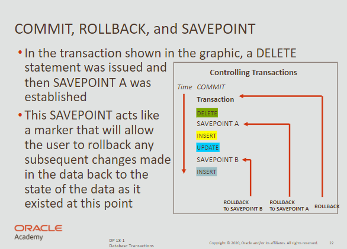
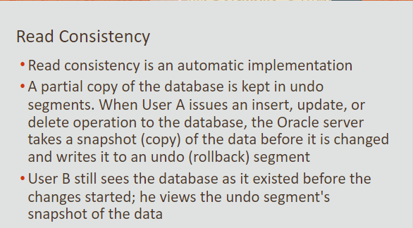

# Database Transactions

- Transactions allow users to save or discard their changes to data.
- A transaction consists of one DML, DDL or DCL statement
- TCL Commands are: `COMMIT`, `ROLLBACK`, `SAVEPOINT`

<br>

### COMMIT

- the point in time where the user has saved his work
- when this is issued all pending changes are permanent
- happens automatically when a DDL / DCL statement is issued

<br>

### ROLLBACK
- discard the changes made to the database

<br>

### SAVEPOINT
- create a marker in a transaction to divide it in smaller pieces

<br>

### ROLLBACK TO SAVEPOINT
- discards only changes made after the savepoint was established

<br>

## Example



<br>

```sql
UPDATE copy_departments
SET manager_id = 101
WHERE department_id = 60;

SAVEPOINT one;
```

<br>

**After more operations, we can restore the versions saved & commit:**

```sql
ROLLBACK TO SAVEPOINT one;

COMMIT;
```

<br>

## Data Consistency



<br>

- After two users worked for several hours, some merging error may occur.
- Oracle uses ***Read Consistency*** to ensure changed do not conflict.
- This way, a consistent view of the data by all users is guaranteed.

<br>

**Important** <br>
If a database crashes, all uncommitted changes are rolled back.